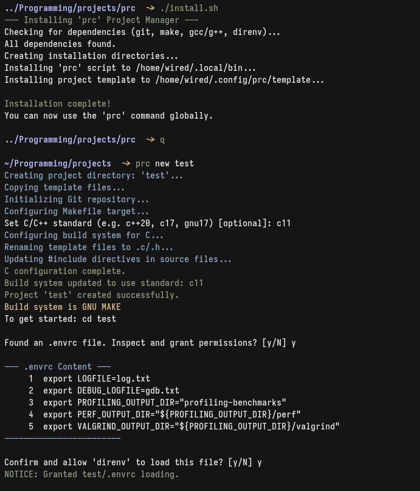
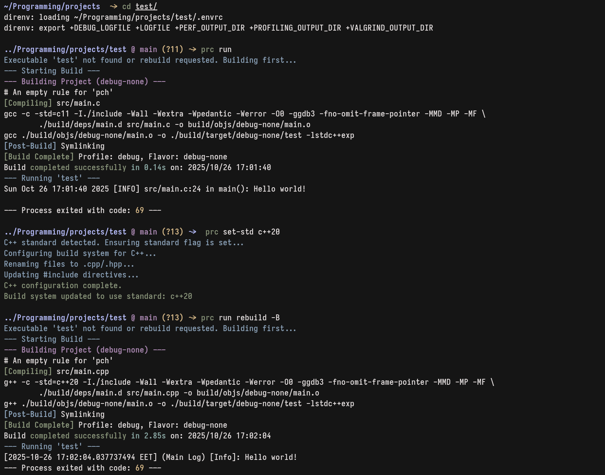

# C/C++ Project Manager (`prc`)

A simple command-line tool to quickly bootstrap, build, and manage C/C++ projects from a consistent template.

## Features

-   Create new C or C++ projects from a flexible Makefile template.
-   Interactively set the language standard (`c17`, `c++23`, etc.).
-   Automatically switches build tools (`gcc` vs `g++`) based on the chosen standard.
-   Simple commands for building and running a project.

## Prerequisites

You need the following tools installed on your system:
-   `git`
-   `make`
-   `gcc` and `g++` (or `clang`)
-   `direnv` (optional, for environment variable management)

## Installation

1.  Clone this repository:
    ```sh
    git clone https://github.com/danylo-volchenko/prc.git
    ```
2.  Navigate into the directory and run the install script:
    ```sh
    cd prc
    ./install.sh
    ```
3.  Restart your shell or source your `.zshrc`/`.bashrc` file.

## Usage
### Create a New Project and follow the instructions
```sh
prc new my-awesome-project
```

### Build a Project
#### Navigate into your project directory and run:
```sh
prc build
```

### You can also pass arguments directly to make:
```sh
prc build -j16
prc build clean
```

### Run the Executable
#### This will automatically build the project if the executable is missing.
```sh
prc run
```
#### To pass arguments to your program:
```sh
prc run --input data.txt --verbose
```
#### Change the Language Standard
```sh
prc set-std c++23
```

## Showcase




